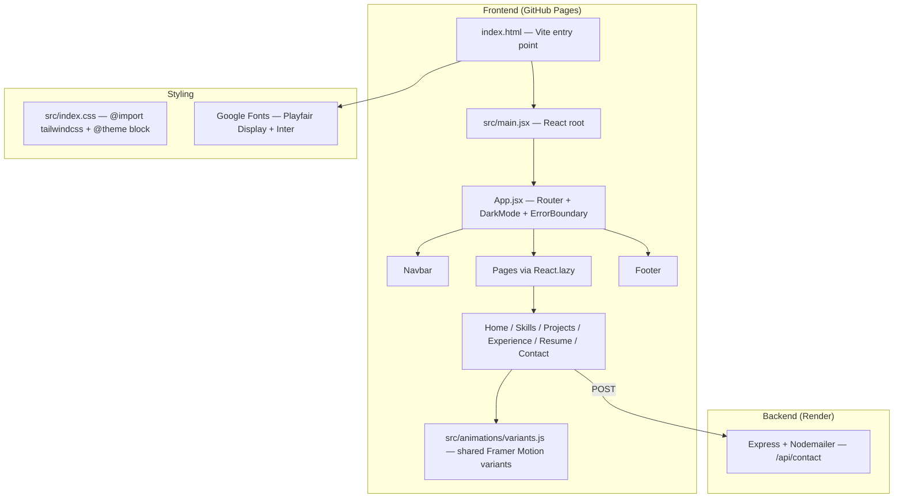
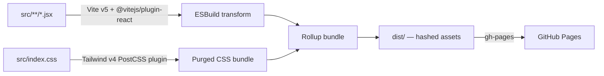

# Design Document: Portfolio Stack Upgrade

## Overview

This document describes the technical design for upgrading the portfolio from its current Create React App (CRA) + Tailwind v3 + react-icons + Poppins stack to a modern, high-performance stack: Vite v5, Tailwind CSS v4, Lucide React, Playfair Display + Inter typography, and cinematic Framer Motion scroll-reveal animations.

The upgrade is purely a toolchain and presentation layer migration. The React 18 component tree, routing structure, dark mode logic, contact form backend, and GitHub Pages deployment workflow are all preserved. No new features are added; the goal is a faster, more polished, more maintainable codebase.

### Key Design Decisions

| Decision | Rationale |
|---|---|
| Vite v5 over CRA | CRA is unmaintained; Vite offers sub-second HMR and faster cold starts |
| Tailwind v4 CSS-first config | Eliminates `tailwind.config.js` and `postcss.config.js`; `@theme` block replaces JS config |
| Lucide React over react-icons | Tree-shakeable, consistent stroke-based SVG set; smaller bundle |
| Playfair Display + Inter | Luxury editorial contrast: serif headings + clean sans-serif body |
| `whileInView` scroll reveals | Replaces mount-time `animate="visible"` so off-screen sections don't animate until visible |
| Shared `variants.js` | Single source of truth for all Framer Motion variants; prevents duplication |

---

## Architecture

The application architecture remains a client-side React SPA served from GitHub Pages, with a separate Express backend on Render for the contact form. The upgrade touches only the frontend layer.



### Build Pipeline



---

## Components and Interfaces

### File Structure Changes

```
Before (CRA)                          After (Vite)
─────────────────────────────────     ─────────────────────────────────
public/index.html                 →   index.html  (project root)
src/index.js                      →   src/main.jsx
package.json (react-scripts)      →   package.json (vite, @vitejs/plugin-react)
tailwind.config.js                →   (deleted)
postcss.config.js                 →   (deleted)
src/index.css (@tailwind base…)   →   src/index.css (@import "tailwindcss" + @theme)
                                      src/animations/variants.js  (NEW)
```

### New File: `src/animations/variants.js`

This module exports all reusable Framer Motion variant objects. Every Page component imports from here instead of defining inline variants.

```js
// src/animations/variants.js

export const fadeUp = {
  hidden: { opacity: 0, y: 40 },
  visible: {
    opacity: 1,
    y: 0,
    transition: { duration: 0.6, ease: 'easeOut' },
  },
}

export const slideInLeft = {
  hidden: { opacity: 0, x: -40 },
  visible: {
    opacity: 1,
    x: 0,
    transition: { duration: 0.5, ease: 'easeOut' },
  },
}

export const staggerContainer = {
  hidden: {},
  visible: {
    transition: { staggerChildren: 0.1 },
  },
}

// Hero-specific: mount-time stagger with custom delay per child
export const heroFadeUp = {
  hidden: { opacity: 0, y: 30 },
  visible: (delay = 0) => ({
    opacity: 1,
    y: 0,
    transition: { duration: 0.6, delay, ease: 'easeOut' },
  }),
}

// Reduced-motion override — applied via CSS media query in index.css
// Components check `useReducedMotion()` from Framer Motion and pass
// this variant instead when the user prefers reduced motion.
export const noMotion = {
  hidden: { opacity: 1, y: 0, x: 0 },
  visible: { opacity: 1, y: 0, x: 0 },
}
```

### `whileInView` Scroll-Reveal Pattern

All page sections (except the Home hero) switch from `initial/animate` to `whileInView`:

```jsx
// Before
<motion.div initial="hidden" animate="visible" variants={containerVariants}>

// After
<motion.div
  initial="hidden"
  whileInView="visible"
  viewport={{ once: true, amount: 0.2 }}
  variants={staggerContainer}
>
```

### Reduced-Motion Support

Each component that uses motion imports `useReducedMotion` from Framer Motion and conditionally swaps variants:

```jsx
import { useReducedMotion } from 'framer-motion'
import { fadeUp, noMotion } from '../animations/variants'

const prefersReduced = useReducedMotion()
const variant = prefersReduced ? noMotion : fadeUp
```

### Vite Entry Point

Vite requires `index.html` at the project root and a JS entry point (conventionally `src/main.jsx`):

```html
<!-- index.html (project root) -->
<!DOCTYPE html>
<html lang="en">
<head>
  <meta charset="UTF-8" />
  <meta name="viewport" content="width=device-width, initial-scale=1.0" />
  <title>Harsh Portfolio</title>
  <!-- Google Fonts: Playfair Display + Inter -->
  <link rel="preconnect" href="https://fonts.googleapis.com" />
  <link rel="preconnect" href="https://fonts.gstatic.com" crossorigin />
  <link href="https://fonts.googleapis.com/css2?family=Playfair+Display:wght@400;700;900&family=Inter:wght@300;400;500;600;700&display=swap" rel="stylesheet" />
</head>
<body>
  <div id="root"></div>
  <script type="module" src="/src/main.jsx"></script>
</body>
</html>
```

```jsx
// src/main.jsx
import React from 'react'
import ReactDOM from 'react-dom/client'
import './index.css'
import App from './App'

ReactDOM.createRoot(document.getElementById('root')).render(
  <React.StrictMode>
    <App />
  </React.StrictMode>
)
```

### `vite.config.js`

```js
import { defineConfig } from 'vite'
import react from '@vitejs/plugin-react'

export default defineConfig({
  plugins: [react()],
  base: './',   // relative base for gh-pages compatibility
  build: {
    outDir: 'dist',
    rollupOptions: {
      output: {
        manualChunks: {
          vendor: ['react', 'react-dom', 'react-router-dom'],
          motion: ['framer-motion'],
        },
      },
    },
  },
})
```

The `manualChunks` split keeps the largest individual JS chunk under 500 KB by separating React/router and Framer Motion into their own chunks.

### Icon Replacement Map

All `react-icons` imports are replaced with `lucide-react`. The `size` prop defaults to `20` unless context requires otherwise.

| File | Old import | New import |
|---|---|---|
| `Navbar.jsx` | `FaSun, FaMoon, FaBars, FaTimes` | `Sun, Moon, Menu, X` |
| `Home.jsx` | `FaGithub, FaLinkedin, FaEnvelope` | `Github, Linkedin, Mail` |
| `Footer.jsx` | `FaGithub, FaLinkedin, FaEnvelope, FaHeart` | `Github, Linkedin, Mail, Heart` |
| `Projects.jsx` | `FaExternalLinkAlt, FaGithub` | `ExternalLink, Github` |
| `Skills.jsx` | `FaPaintBrush, FaCode, FaDatabase, FaToolbox, FaCogs, FaLaptopCode` | `Paintbrush, Code2, Database, Wrench, Settings, Monitor` |
| `Experience.jsx` | `FaBriefcase, FaLaptopCode` | `Briefcase, Monitor` |

Decorative icons (e.g., `Heart` in Footer) receive `aria-hidden="true"`. Meaningful icons (e.g., `Github` links) rely on the parent `<a>` element's existing `aria-label`.

---

## Data Models

This upgrade introduces no new data models. The existing in-file data arrays (`projects`, `skillsData`, `experiences`) remain unchanged. The only structural addition is the `variants.js` module, which exports plain JavaScript objects (not stateful data).

### Animation Variant Shape

```ts
// Conceptual TypeScript shape (project uses JSX, not TS)
type MotionVariant = {
  hidden: { opacity?: number; y?: number; x?: number }
  visible: {
    opacity?: number
    y?: number
    x?: number
    transition?: {
      duration?: number
      delay?: number
      ease?: string
      staggerChildren?: number
    }
  }
}
```

### Tailwind `@theme` Block (CSS Data Model)

The `@theme` block in `src/index.css` replaces `tailwind.config.js` as the source of custom design tokens:

```css
@import "tailwindcss";

@theme {
  --font-playfair: 'Playfair Display', Georgia, serif;
  --font-inter: 'Inter', system-ui, sans-serif;

  --animate-fade-in: fadeIn 1s ease-in-out;
  --animate-fade-in-slow: fadeIn 2s ease-in-out;
  --animate-slide-in: slideIn 1s ease-in-out;

  @keyframes fadeIn {
    from { opacity: 0; }
    to   { opacity: 1; }
  }

  @keyframes slideIn {
    from { opacity: 0; transform: translateY(-20px); }
    to   { opacity: 1; transform: translateY(0); }
  }
}

body {
  font-family: var(--font-inter);
}

h1, h2, h3 {
  font-family: var(--font-playfair);
}
```

This exposes `font-playfair`, `font-inter`, `animate-fade-in`, `animate-fade-in-slow`, and `animate-slide-in` as Tailwind utility classes.

---

## Correctness Properties

*A property is a characteristic or behavior that should hold true across all valid executions of a system — essentially, a formal statement about what the system should do. Properties serve as the bridge between human-readable specifications and machine-verifiable correctness guarantees.*

### Property 1: Icon accessibility invariant

*For any* Lucide React icon rendered in the Portfolio_App, if the icon conveys meaningful information (i.e., it is the sole content of an interactive element), then its parent element SHALL have a non-empty `aria-label` attribute; if the icon is purely decorative, it SHALL have `aria-hidden="true"`.

**Validates: Requirements 3.3, 3.5**

---

### Property 2: Dark mode persistence round-trip

*For any* dark mode state (true or false), toggling dark mode and then reading `localStorage.getItem('darkMode')` SHALL return the string representation of that state, and the root `<div>` SHALL have the `dark` class if and only if dark mode is active.

**Validates: Requirements 6.4**

---

### Property 3: Scroll-reveal viewport threshold invariant

*For any* scroll-reveal `<motion.*>` element in the Portfolio_App (excluding the Home hero), the element SHALL have `viewport={{ once: true, amount: 0.2 }}` set, ensuring it animates exactly once and only when at least 20% is visible.

**Validates: Requirements 5.7, 5.8**

---

### Property 4: Reduced-motion renders final state immediately

*For any* animated element in the Portfolio_App, when `prefers-reduced-motion: reduce` is active, the element SHALL render with `opacity: 1` and no transform offset (i.e., in its final visible state) without any transition delay.

**Validates: Requirements 5.10**

---

### Property 5: Typography class coverage

*For any* heading element (`h1`, `h2`, `h3`) rendered in the Portfolio_App, the computed `font-family` SHALL resolve to Playfair Display; *for any* body text element, the computed `font-family` SHALL resolve to Inter. No element SHALL have a `font-poppins` class.

**Validates: Requirements 4.2, 4.3, 4.4, 4.5, 4.6, 4.7**

---

### Property 6: Contact form submission preserves data

*For any* valid contact form submission (non-empty name, valid email, non-empty message), the data POSTed to the backend SHALL exactly match the values entered in the form fields — no field SHALL be dropped, trimmed, or mutated before transmission.

**Validates: Requirements 6.1**

---

## Error Handling

### Build-Time Errors

| Scenario | Handling |
|---|---|
| Unresolvable module import | Vite emits a descriptive error identifying the missing module and the importing file; build fails fast |
| Missing Tailwind v4 utility class | PostCSS plugin emits a warning; developer replaces with v4 equivalent or custom CSS |
| Lucide icon name not found | TypeScript/IDE tooling surfaces the error at import time; no runtime crash |

### Runtime Errors

| Scenario | Handling |
|---|---|
| Contact form network failure | `catch` block sets `statusMessage` to `'Failed to send enquiry.'`; no crash |
| Contact form non-OK response | Response body parsed for `error` field; fallback message shown |
| Page component lazy-load failure | `ErrorBoundary` wrapping `Suspense` catches the error and renders fallback UI |
| `localStorage` unavailable (private browsing) | `try/catch` in `App.jsx` already guards both read and write; defaults to `false` |
| Framer Motion `useReducedMotion` returns `null` | Treated as `false` (motion enabled); no crash |

### Migration-Specific Error Risks

| Risk | Mitigation |
|---|---|
| CRA `%PUBLIC_URL%` references in `index.html` | Replace with Vite's `/` absolute paths or `import.meta.url` |
| `process.env.REACT_APP_*` references | Search codebase; replace with `import.meta.env.VITE_*` |
| `react-scripts` test runner removed | Replace with Vitest (compatible with Vite) if tests are added |
| Tailwind v3 classes removed in v4 | Audit all class names against v4 changelog; replace deprecated classes |
| `react-icons` tree-shaking differences | Verify bundle size after switch; Lucide is fully tree-shakeable by default |

---

## Testing Strategy

### Overview

This upgrade is a refactoring migration, not a feature addition. The primary testing concern is regression prevention — ensuring the visual output, interactions, and data flows are identical before and after the migration.

PBT applicability assessment: Several acceptance criteria are amenable to property-based testing (icon accessibility invariants, dark mode persistence, typography coverage, reduced-motion behavior). These are captured in the Correctness Properties section above. The majority of criteria are better served by example-based tests and visual regression checks.

### Unit Tests (Example-Based)

Use **Vitest** + **React Testing Library** (compatible with Vite; replaces Jest/CRA test runner).

| Test | What it verifies |
|---|---|
| `Navbar` renders Sun icon in dark mode, Moon in light mode | Req 3.4 |
| `Navbar` mobile menu opens/closes with Menu/X icons | Req 3.4, 6.6 |
| `Contact` form submits correct payload to backend URL | Req 6.1 |
| `Contact` form shows error message on network failure | Req 6.2 |
| `App` reads `darkMode` from `localStorage` on mount | Req 6.4 |
| `App` writes `darkMode` to `localStorage` on toggle | Req 6.4 |
| `Resume` page renders PDF download link with correct `href` | Req 6.3 |
| All pages render without crashing (smoke tests) | Req 6.10 |

### Property-Based Tests

Use **fast-check** (JavaScript PBT library) with Vitest. Each property test runs a minimum of 100 iterations.

**Feature: portfolio-stack-upgrade, Property 2: Dark mode persistence round-trip**
```js
// For any boolean darkMode value, toggling and reading localStorage
// returns the correct string, and the root div class is correct.
fc.assert(fc.property(fc.boolean(), (isDark) => { ... }), { numRuns: 100 })
```

**Feature: portfolio-stack-upgrade, Property 6: Contact form submission preserves data**
```js
// For any valid {name, email, message} triple, the fetch body
// matches the input exactly.
fc.assert(fc.property(
  fc.record({ name: fc.string({ minLength: 1 }), email: fc.emailAddress(), message: fc.string({ minLength: 1 }) }),
  (formData) => { ... }
), { numRuns: 100 })
```

### Visual Regression Tests

Manual visual comparison before/after migration for each page in both light and dark mode:

- Home hero (avatar, name, typewriter, buttons, social icons)
- Skills grid (card layout, icon rendering)
- Projects grid (filter tags, card hover)
- Experience timeline (left-border layout, icons)
- Resume page (download button)
- Contact form (input fields, submit button)
- Navbar (desktop links, mobile menu, dark mode toggle)
- Footer (social icons, copyright)

### Build Verification

```bash
# Verify Vite build succeeds and chunk sizes are within limits
npm run build
# Check dist/ — largest JS chunk must be < 500 KB uncompressed

# Verify gh-pages deployment workflow
npm run deploy
```

### Accessibility Checks

- Run `axe-core` or browser DevTools accessibility audit on each page after migration
- Verify all Lucide icons have correct `aria-label` or `aria-hidden` attributes
- Verify contrast ratios meet WCAG AA (4.5:1 body, 3:1 large text) in both light and dark mode with new typefaces
